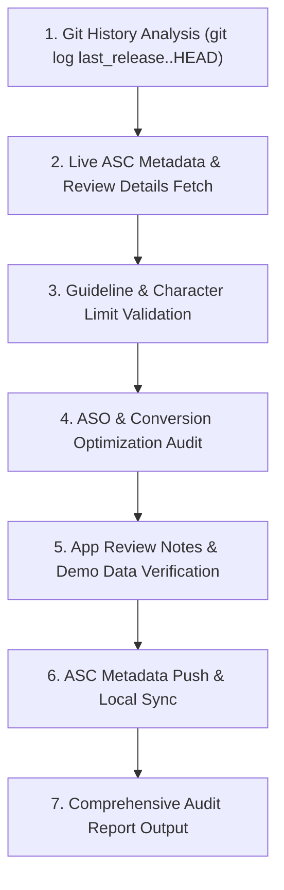

# StarLuna App Store Connect Metadata & Review Notes Auditor (`sl-asc-metadata-auditor`)

A specialized quality-assurance and optimization skill that inspects, audits, enhances, and synchronizes all user-facing texts and App Reviewer instructions in App Store Connect before submission to App Review.

---

## 🎯 Objectives & Core Principles

1. **Zero Ambiguity for App Reviewers (Guideline 2.1 & 2.3)**:
   - Provide a direct, friction-free testing path for App Store Reviewers.
   - Explicitly document test credentials, pre-populated demo data, and step-by-step navigation for every new feature shipped in the release.
   - Ensure reviewers understand the paywall/free-tier boundaries so test accounts are never blocked from evaluating the app.

2. **Commit-Driven What's New & Release Notes**:
   - Extract the full commit range since the last publicly released version (`git log <last-release>..HEAD`).
   - Translate low-level code commits and architectural enhancements into punchy, value-focused user bullet points for `whatsNew`.

3. **High-Converting ASO & Copywriting Standards**:
   - **Promotional Text** (≤170 chars): Deliver a compelling value hook that drives downloads before the user taps "More".
   - **Description** (≤4000 chars): Clear value propositions, benefit-driven feature breakdown, target audience definition, privacy assurances, and explicit subscription terms (EULA / Privacy Policy).
   - **Keywords** (≤100 chars): High-intent, non-duplicated search terms (no redundant words already present in Title/Subtitle).
   - **Title & Subtitle** (≤30 chars each): Distinctive branding + high-relevance category intent.

4. **Compliance with 2026 App Store Review Guidelines**:
   - **2.1 (App Completeness)**: Live backend, active demo account with pre-loaded project data, clear test steps.
   - **2.3 (Accurate Metadata)**: No misleading capabilities, no undocumented features, honest representation of platform support.
   - **3.1.1 / 3.1.2 (In-App Purchases & Subscriptions)**: Clear explanation of free allowances vs. auto-renewable subscription ($4.99/mo), Restore Purchases availability, and links to Terms of Use & Privacy Policy.
   - **4.7 & 4.7.1 (AI Software & Content Safety)**: Clarify user agency over AI generation (reviewing/editing before posting, content moderation guardrails, and no unauthorized data sharing).
   - **5.1.1 / 5.1.2 (Data Collection & Privacy)**: Accurate alignment with Apple Privacy Nutrition Labels and Sign in with Apple privacy standards.

---

## 🛠️ Audit & Synchronization Workflow



---

## 📋 The 5-Step Audit Procedure

### Step 1: Trace Shipped Commits Since Last Public Release
Query the repository's git history to capture all features, fixes, and UX updates:
```bash
git log --oneline $(git describe --tags --abbrev=0 2>/dev/null || echo "HEAD~20")..HEAD
```
Group findings into:
- New User Capabilities
- Platform Support Expansions
- AI & Generation Enhancements
- Bug Fixes & Stability Improvements

### Step 2: Fetch Live ASC Data & Local Metadata
Inspect existing metadata across both App Store Connect and local repository configuration (`metadata/`):
```bash
source .asc/app.env
VERSION_ID=$(asc versions list --app "$APP_ID" --platform IOS --output json | jq -r '.data[0].id')
asc versions view --id "$VERSION_ID" --pretty
asc localizations list --version "$VERSION_ID" --pretty
asc review details-for-version --version-id "$VERSION_ID" --pretty
asc pricing current --app "$APP_ID" --pretty
asc subscriptions pricing summary --app "$APP_ID" --pretty
```

### Step 3: Execute the Metadata Audit Checklist

| Field | Max Limit | Audit Criteria |
|---|---|---|
| **App Title** | 30 chars | Clear brand name + concise primary differentiator. |
| **Subtitle** | 30 chars | High-intent category keyword phrase, no duplicate brand words. |
| **Keywords** | 100 chars | Comma-separated, no spaces after commas, no single-word repeats from Title/Subtitle. |
| **Promotional Text** | 170 chars | Impactful hook explaining product benefit; updateable without a new binary submission. |
| **Description** | 4000 chars | Structured sections: Hook, Value Props, Feature Bullets, Target Audience, Privacy, Pricing/Terms. |
| **What's New** | 4000 chars | 4–7 bullet points covering user-facing capabilities shipped in this version. |
| **Review Notes** | 4000 chars | Demo credentials, pre-loaded data walkthrough, feature testing steps, paywall/IAP sandbox instructions. |

### Step 4: Verify Demo Account & Reviewer Instructions
Reviewers must never be stuck or puzzled:
1. **Demo Account Status**: Valid credentials provided (`demoAccountName`, `demoAccountPassword`).
2. **Pre-Loaded Demo Data**: Specify exact pre-loaded project name (e.g. `"Shooting Star"`) and what items are already populated (sources, completed details).
3. **Feature Test Path**: Sequential, numbered testing steps for every in-scope tab (Workspace, Schedule/Calendar, Polish, Profile).
4. **Subscription Paywall Testing**: Explain the free tier policy (e.g., first 4 reveals free per project) and confirm that no purchase is required to inspect the paywall, Restore Purchases, or legal terms.

### Step 5: Synchronize & Generate Audit Report
1. Push validated metadata and review notes to App Store Connect via `asc`.
2. Sync local files: `metadata/en-US/*`, `metadata/review.json`, `.asc/releases/<version>.md`.
3. Output the structured Audit Report summarizing decisions, guidelines verified, and final character metrics.

---

## ⚡ Quick Reference Commands

```bash
# Update Version Localization (What's New, Description, Promo Text)
asc localizations update \
  --version "$VERSION_ID" \
  --locale "en-US" \
  --whats-new "$WHATS_NEW" \
  --description "$DESCRIPTION" \
  --promotional-text "$PROMO"

# Update App Review Information (Reviewer Notes & Demo Credentials)
asc review details-update \
  --id "$REVIEW_DETAIL_ID" \
  --notes "$REVIEW_NOTES"

# Update App Info Localization (Subtitle)
asc localizations update \
  --app "$APP_ID" \
  --type app-info \
  --locale "en-US" \
  --subtitle "$SUBTITLE"
```
