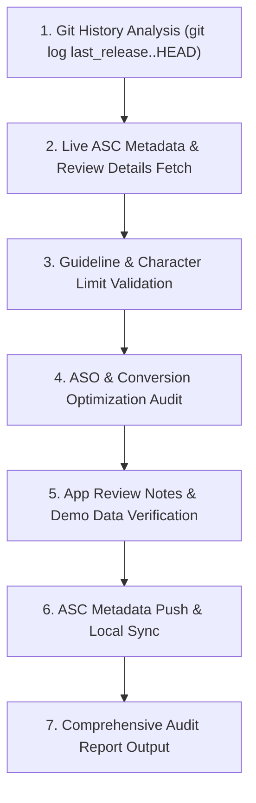

# StarLuna App Store Connect Metadata & Review Notes Auditor (`sl-asc-metadata-auditor`)

A specialized quality-assurance and optimization skill that inspects, audits, enhances, and synchronizes all user-facing texts and App Reviewer instructions in App Store Connect before submission to App Review.

---

## 🎯 Objectives & Core Principles

1. **Zero Drift via Live Backend Ground-Truth Verification**:
   - Never write App Review notes based on assumptions or stale mock data.
   - Actively query and inspect the live database/backend (e.g. Firestore, Firebase Auth, PostgreSQL) to verify that the demo account exists, the pre-loaded project name matches exactly, evidence/briefs are populated, and subscription entitlements match the stated review flow.

2. **Zero Legacy Noise & Complexity Reduction**:
   - Do **NOT** list features that were already shipped and approved in previous releases.
   - Protect App Reviewers from cognitive overload by focusing notes strictly on what is relevant and newly reviewable in *this* submission.

3. **Strict "Visible & Testable" Filter**:
   - Only document features and flows that are directly visible on screen and physically testable by the reviewer.
   - Every note item must map to a numbered, step-by-step action path (tap button → view sheet → perform action) that can be verified in under 2 minutes.

4. **Commit-Driven What's New & Release Notes**:
   - Extract the full commit range since the last publicly released version (`git log <last-release>..HEAD`).
   - Translate low-level code commits and architectural enhancements into punchy, value-focused user bullet points for `whatsNew`.

5. **High-Converting ASO & Copywriting Standards**:
   - **Promotional Text** (≤170 chars): Deliver a compelling value hook that drives downloads before the user taps "More".
   - **Description** (≤4000 chars): Clear value propositions, benefit-driven feature breakdown, target audience definition, privacy assurances, and explicit subscription terms (EULA / Privacy Policy).
   - **Keywords** (≤100 chars): High-intent, non-duplicated search terms (no redundant words already present in Title/Subtitle).
   - **Title & Subtitle** (≤30 chars each): Distinctive branding + high-relevance category intent.

6. **Compliance with 2026 App Store Review Guidelines**:
   - **2.1 (App Completeness)**: Live backend, active demo account with pre-loaded project data, clear test steps.
   - **2.3 (Accurate Metadata)**: No misleading capabilities, no undocumented features, honest representation of platform support.
   - **3.1.1 / 3.1.2 (In-App Purchases & Subscriptions)**: Clear explanation of free allowances vs. auto-renewable subscription ($4.99/mo), Restore Purchases availability, and links to Terms of Use & Privacy Policy.
   - **4.7 & 4.7.1 (AI Software & Content Safety)**: Clarify user agency over AI generation (reviewing/editing before posting, content moderation guardrails, and no unauthorized data sharing).
   - **5.1.1 / 5.1.2 (Data Collection & Privacy)**: Accurate alignment with Apple Privacy Nutrition Labels and Sign in with Apple privacy standards.

---

## 📚 Official Apple Guidelines & Policy References

1. **[Guideline 2.1 — App Completeness](https://developer.apple.com/app-store/review/guidelines/#app-completeness)**:
   > *"If your app includes account-based features, provide an active demo account or fully-configured demo mode… If any in-app purchase items cannot be easily found, provide a detailed explanation in the App Review notes."*
2. **[Guideline 2.3 — Accurate Metadata](https://developer.apple.com/app-store/review/guidelines/#accurate-metadata)**:
   > *"Apps must clearly describe new features and product changes in the ‘What’s New’ text… more significant changes must be explicitly listed."*
3. **[App Store Connect Help — Provide App Review Information](https://developer.apple.com/help/app-store-connect/manage-app-information/provide-app-review-information/)**:
   > *"Provide instructions and credentials necessary for our team to test your app… Include steps to access paid features or non-obvious functionality."*
4. **Policy on Repeating Old Features**:
   - **"What's New" (User-Facing)**: **Never** repeat features from past releases. Strictly describe the delta/changes for the current version.
   - **"App Review Notes" (Internal)**: Do **not** repeat old feature descriptions. Specify only testing steps for newly reviewable features and the minimum access constraint required for those steps. Keep credentials in ASC's dedicated fields.

---

## 🛠️ Audit & Synchronization Workflow



---

## 📋 The 5-Step Audit Procedure

### Step 1: Trace Shipped Commits Since Last Public Release
Query the repository's git history to capture all features, fixes, and UX updates:
```bash
git log --oneline $(git describe --tags --abbrev=0 2>/dev/null || echo "HEAD~20")..HEAD
```
Group findings into:
- New User Capabilities
- Platform Support Expansions
- AI & Generation Enhancements
- Bug Fixes & Stability Improvements

### Step 2: Fetch Live ASC Data & Local Metadata
Inspect existing metadata across both App Store Connect and local repository configuration (`metadata/`):
```bash
source .asc/app.env
VERSION_ID=$(asc versions list --app "$APP_ID" --platform IOS --output json | jq -r '.data[0].id')
asc versions view --id "$VERSION_ID" --pretty
asc localizations list --version "$VERSION_ID" --pretty
asc review details-for-version --version-id "$VERSION_ID" --pretty
asc pricing current --app "$APP_ID" --pretty
asc subscriptions pricing summary --app "$APP_ID" --pretty
```

### Step 3: Execute the Metadata Audit Checklist

| Field | Max Limit | Audit Criteria |
|---|---|---|
| **App Title** | 30 chars | Clear brand name + concise primary differentiator. |
| **Subtitle** | 30 chars | High-intent category keyword phrase, no duplicate brand words. |
| **Keywords** | 100 chars | Comma-separated, no spaces after commas, no single-word repeats from Title/Subtitle. |
| **Promotional Text** | 170 chars | Impactful hook explaining product benefit; updateable without a new binary submission. |
| **Description** | 4000 chars | Structured sections: Hook, Value Props, Feature Bullets, Target Audience, Privacy, Pricing/Terms. |
| **What's New** | 4000 chars | Only the user-facing capabilities added or materially changed in this version. Use as few bullets as accurately cover the release. |
| **Review Notes** | 4000 chars | Only the shortest test paths for newly reviewable behavior, plus any access constraint required to test that behavior. Do not duplicate credentials from ASC's dedicated fields. |

### Step 4: Verify Demo Account, Backend Ground-Truth & Reviewer Notes

To ensure zero friction and zero review delays, strictly enforce the **Three Golden Rules of Reviewer Notes**:

1. **Rule 1: Backend Ground-Truth (Zero Drift)**:
   - Query live auth and database services (e.g. `npx firebase-tools auth:export`, Firestore REST API / SDK, PostgreSQL) to inspect the demo account state.
   - Confirm the demo account UID exists and matches the configured credentials.
   - Confirm the exact project name stated in review notes (e.g. `"Shooting Star"`) exists in the database with non-null required attributes (brief profile, brief versions, source URLs/evidence).
   - Verify subscription entitlements in database match what notes state (`isEntitled = false` for free-tier testing).

2. **Rule 2: Zero Legacy Noise (Complexity Reduction)**:
   - Strip out descriptions of features released and approved in previous app versions, even when they are part of the reviewer’s path through the app.
   - Reviewers must not be overwhelmed with legacy architectural summaries; keep notes razor-focused on the active review scope.

3. **Rule 3: Actionable Tap-Paths Only (Visible & Testable)**:
   - Every bullet must guide the reviewer to a physical, testable interaction that was added or materially changed in the candidate release.
   - Omit established Workspace, AI, Polish, sign-in, subscription, legal-link, and account-management flows unless the candidate release changes them in a way the reviewer must test.
   - State only the minimum reliable path and any constraint that prevents a misleading result. For example: *Calendar*: choose a project with filter chips → reveal a draft in Social Plan → tap Review & Schedule → edit a preset local time → save a manual reminder. *LinkedIn*: connect an account in Profile → publish a text post when chosen; other platforms use copy/open handoff.

### Step 5: Synchronize & Generate Audit Report
1. Push validated metadata and review notes to App Store Connect via `asc`.
2. Sync local files: `metadata/en-US/*`, `metadata/review.json`, `.asc/releases/<version>.md`.
3. Output the structured Audit Report summarizing decisions, guidelines verified, and final character metrics.

---

## ⚡ Quick Reference Commands

```bash
# Update Version Localization (What's New, Description, Promo Text)
asc localizations update \
  --version "$VERSION_ID" \
  --locale "en-US" \
  --whats-new "$WHATS_NEW" \
  --description "$DESCRIPTION" \
  --promotional-text "$PROMO"

# Update App Review Information (Reviewer Notes & Demo Credentials)
asc review details-update \
  --id "$REVIEW_DETAIL_ID" \
  --notes "$REVIEW_NOTES"

# Update App Info Localization (Subtitle)
asc localizations update \
  --app "$APP_ID" \
  --type app-info \
  --locale "en-US" \
  --subtitle "$SUBTITLE"
```
