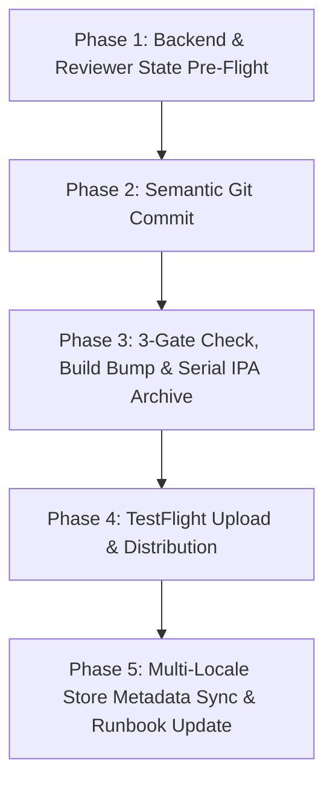

# StarLuna Luna Bee iOS Release & TestFlight Workflow (`sl-ios-lunabee-push-to-testflight`)

A standardized, highly safe end-to-end release pipeline for the **Luna Bee (path)** iOS application (`app.starluna.lunabee.ios`, App ID `6773575794`). This skill automates the full progression from code verification to live TestFlight distribution, database sync, and App Store Connect metadata synchronization while strictly enforcing production safety gates.

---

## 🧭 Operating Principles & Safety Gates

1. **Dual-Environment Backend Parity**:
   - All migrations, schemas, and Edge Functions must be in sync between UAT (`ozzplxtasqeraivncmwt`) and PROD (`qxdqubhvtcyuipxudkzk`).
   - Verified via `bash scripts/deploy-status.sh` in `starluna-backend`.
2. **Reviewer Demo State Seeding**:
   - Ensure the Apple App Reviewer account (`demo@starluna.app`) has active children, events, challenges, and conversations seeded before submission using `scripts/seed-apple-reviewer-demo.sh`.
3. **The 3 Hard Release Gates (`scripts/release.sh`)**:
   - **Gate 1**: Working tree clean and HEAD synced with remote origin (deploy must strictly match origin).
   - **Gate 2**: Monotonic build number greater than the maximum build on App Store Connect (prevents build collision).
   - **Gate 3**: Archived `Secrets.plist` verified for `STARLUNA_ENVIRONMENT == production` and `SUPABASE_URL == qxdqubhvtcyuipxudkzk` (hard stop: never ship a UAT binary).
4. **Strictly Serial Archive Execution**:
   - Never run `xcodebuild archive` concurrently with test runs, simulator processes, or active builds to avoid SQLite `build.db` lock contention.
5. **Detailed Semantic Commit Logs**:
   - Capture architectural rationale, Swift 6 concurrency boundaries, UI/UX tokens, and model decisions.
6. **Multi-Locale Metadata Sync**:
   - Maintain canonical file-backed metadata under `metadata/version/<version>/<locale>/` (supporting `en-US`, `zh-Hans`, and other supported locales).

---

## 🛠️ The 5-Phase Release Workflow



---

### Phase 1 — Backend & Reviewer State Pre-Flight

1. **Verify Backend Migration Parity**:
   In `~/Projects/starluna-backend`, check database drift across both environments:
   ```bash
   bash scripts/deploy-status.sh
   ```
   *Ensure both UAT and PROD report "✅ in sync".*

2. **Seed Apple Reviewer Demo Account**:
   Ensure `demo@starluna.app` is seeded with realistic family events, challenges, and roster data:
   ```bash
   bash scripts/seed-apple-reviewer-demo.sh
   ```

3. **Verify Local iOS Compile Health**:
   Ensure there are zero compilation errors before proceeding:
   ```bash
   xcodebuild -project path.xcodeproj -scheme path -destination 'generic/platform=iOS' build -quiet
   ```

---

### Phase 2 — Commit All Changes with Architectural Rationale

1. Inspect modified and untracked files:
   ```bash
   git status
   git diff
   ```
2. Formulate a structured commit message:
   - **Header**: Conventional format (`feat(...)`, `fix(...)`, `refactor(...)`).
   - **Summary**: Concise bullet list of features, bug fixes, and UX updates.
   - **Architecture & Concurrency**: Detail changes to observable stores (`AIAssistantStore`, `LocaleStore`), Swift Concurrency isolation, and repository abstractions.
   - **UI/UX & Design System**: Document updates adhering to the "Warm & Cozy" design system (`AppTheme`, `AppTypography`, `swift-markdown-ui`).
   - **Backend & Edge Functions**: Document edge function updates (`astraea-chat`), schema migrations, and prompt directives.
3. Stage and commit:
   ```bash
   git add .
   git commit -m "<Structured commit message>"
   ```

---

### Phase 3 — 3-Gate Check, Build Bump, Archive & Automated ASC Upload

1. **Pre-flight Gate Check (Dry Run)**:
   ```bash
   bash scripts/release.sh --check
   ```

2. **Auto-Bump Monotonic Build Number, Archive & Upload**:
   Run the project release pipeline in bump mode:
   ```bash
   bash scripts/release.sh --bump
   ```
   *This command executes all safety gates serially:*
   - **Gate 1**: Verifies Git status is clean and HEAD is pushed to origin.
   - **Gate 2**: Queries App Store Connect for the current maximum build number and auto-increments `CURRENT_PROJECT_VERSION` in `path.xcodeproj/project.pbxproj`.
   - Automatically commits and pushes the build bump commit.
   - Serially builds the archive at `build/path.xcarchive`.
   - Exports the signed IPA to `build/ipa/path.ipa` using `ExportOptions.plist` (Team ID `6X7A9UDFK7`).
   - **Gate 3**: Validates that `Secrets.plist` inside the exported bundle points to PROD (`qxdqubhvtcyuipxudkzk` / `STARLUNA_ENVIRONMENT == production`).
   - Uploads the signed IPA to App Store Connect and waits for build indexing.

---

### Phase 4 — TestFlight Build Verification & Distribution

1. **Verify Build Status on App Store Connect**:
   Confirm that the newly uploaded build has reached `VALID` status:
   ```bash
   APP_ID=6773575794
   asc builds list --app "$APP_ID" --output table | head -5
   ```

2. **TestFlight Group Access**:
   Internal test groups (e.g., "The Inner Circle" with `hasAccessToAllBuilds: true`) receive the build immediately upon reaching `VALID` state. External groups can be managed or assigned via:
   ```bash
   asc testflight groups list --app "$APP_ID"
   ```

---

### Phase 5 — Multi-Locale Store Metadata Sync & Runbook Update

> [!IMPORTANT]
> **Cumulative Release Scope Rule**:
> When preparing and updating store notes (`What's New`, `Promotional Text`, and `App Review Notes`), always gather all user-facing changes accumulated **since the last live released App Store version & build** (e.g., v1.5.0 Build 57), NOT just the delta from intermediate TestFlight builds.
> Focus strictly on noticeable, user-friendly improvements in the iOS app (avoid backend/database internal jargon).

1. **Sync Version What's New & Promotional Text**:
   Update release notes and promotional text for the current version:
   ```bash
   VERSION_ID=$(asc versions list --app "$APP_ID" --platform IOS --output json | jq -r '.data[0].id')
   
   asc localizations update \
     --version "$VERSION_ID" \
     --locale "en-US" \
     --whats-new "• AI Markdown: Integrated swift-markdown-ui for rich Markdown formatting across cards.
• Unboxed AI Chat: Clean, modern card-free assistant responses sitting directly on canvas.
• 7-Day Local Activities Map: Explore full 7-day upcoming family activities with instant day/evening filters and neighborhood map discovery.
• Memory Privacy & Controls: Easily manage, turn off, or clear Luna Bee assistant memory at any time.
• Full Localization: Multi-language support for AI landing action chips and slash commands across all 8 languages."
   ```

2. **Update App Review Notes & Test Credentials**:
   Inspect existing review details and update review instructions or credentials:
   ```bash
   REVIEW_DETAIL_ID=$(asc review details-for-version --version-id "$VERSION_ID" --output json | jq -r '.data.id')
   
   asc review details-update \
     --id "$REVIEW_DETAIL_ID" \
     --notes "What's New in Version <version>:
<Bullet list of major changes accumulated since last released version>

Demo account credentials:
Username: apple@starluna.app
Password: Demo1234!"
   ```

3. **Pull Canonical Metadata & Commit**:
   Keep local metadata files in sync with App Store Connect:
   ```bash
   asc metadata pull --app "$APP_ID" --version "<version>" --dir ./metadata --force
   git add metadata/
   git commit -m "chore(metadata): sync canonical <version> App Store metadata"
   git push origin main
   ```

4. **Update Release Documentation**:
   Update `docs/STATUS.md` and `docs/checklists/build-runbook.md` with the new build number, commit hash, and changelog.

---

## ⚡ Quick Reference Command Matrix

| Step | Command |
|---|---|
| Verify Backend Parity | `cd ~/Projects/starluna-backend && bash scripts/deploy-status.sh` |
| Seed Reviewer Demo DB | `bash scripts/seed-apple-reviewer-demo.sh` *(requires `PROD_DB_PASSWORD`)* |
| Release Dry-Run Check | `bash scripts/release.sh --check` |
| Auto-Bump, Build & Upload | `bash scripts/release.sh --bump` |
| Check ASC Builds | `asc builds list --app 6773575794 --output table` |
| Update What's New | `asc localizations update --version "$VERSION_ID" --locale "en-US" --whats-new "..."` |
| Update Review Notes | `asc review details-update --id "$REVIEW_DETAIL_ID" --notes "..."` |
| Pull Canonical Metadata | `asc metadata pull --app 6773575794 --version "<version>" --dir ./metadata --force` |
