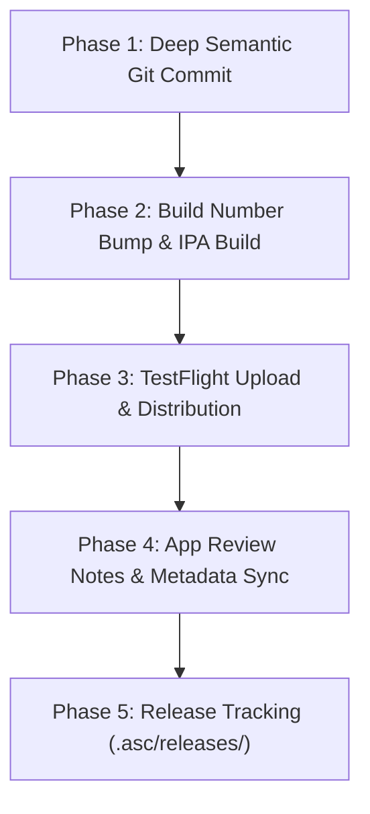

# StarLuna iOS Release & TestFlight Workflow (`sl-ios-push-to-testflight`)

A standardized, end-to-end release pipeline for StarLuna iOS applications (e.g. `Shooting Star`, `Luna Bee`). This skill automates the full progression from dirty worktree to live TestFlight distribution and App Store Connect metadata synchronization while maintaining clean, auditable commit logs and metadata tracking.

---

## 🧭 Operating Principles & Skill Seams

1. **Detailed Semantic Commit Logs**: Every release commit must capture not only *what* changed, but the underlying **architecture design**, **UI/UX decisions**, and **important decision rationale**.
2. **Monotonic Build Numbers**: Never guess build numbers. Always query App Store Connect via `asc builds next-build-number` (or the project's `testflight-next-build.sh --bump`) to ensure zero build collision.
3. **Strictly Serial Archive Execution**: Follow project rules—never run `xcodebuild archive` concurrently with tests or simulator processes to prevent SQLite `build.db` lock contention.
4. **Surgical & Non-Disruptive Metadata Updates**:
   - **App Review Notes**: Inspect existing notes; append or refine instructions specifically covering new features from the latest commit range so reviewers have an exact test path.
   - **What's New / TestFlight Notes**: Clear, user-facing summary of new capabilities and fixes since the last released version.
   - **App Description**: Never make drastic rewrites. Make targeted, surgical enhancements reflecting new features and clearly document the diff.
5. **Reuses Existing Tooling**: Composes with `asc` CLI, `xcodebuildmcp`, and repo-native scripts (`scripts/testflight-next-build.sh`, `scripts/archive-and-export.sh`, `scripts/push-metadata.sh`, `.asc/app.env`).

---

## 🛠️ The 4-Phase Workflow



---

### Phase 1 — Commit All Changes with Architectural Rationale

1. Inspect modified and untracked files:
   ```bash
   git status
   git diff
   ```
2. Formulate a structured, multi-paragraph commit message:
   - **Header**: Standard conventional commit format (`feat(...)`, `fix(...)`, `refactor(...)`).
   - **Summary**: Concise bullet list of features, bug fixes, and UX updates.
   - **Architecture & Concurrency**: Detail changes to observable stores (`AppStore`), Swift 6 Sendable boundaries, repository abstractions, caching layers, and database schemas/composite keys.
   - **UI/UX & Design Tokens**: Document changes to view hierarchies, typography/color tokens (`Theme.*`), scrolling/layout containers, and accessibility affordances.
   - **Key Decisions & Trade-offs**: Note rationale for specific patterns (e.g. Firestore composite document keys to isolate per-platform state, fallback caching strategies, multimodal API integration choices).
3. Stage and commit:
   ```bash
   git add .
   git commit -m "<Structured commit message>"
   ```

---

### Phase 2 — Check Version, Auto-Bump Build Number & Build IPA

1. **Verify Environment & Config**:
   ```bash
   source .asc/app.env
   cat Config/Shared.xcconfig | grep -E "MARKETING_VERSION|CURRENT_PROJECT_VERSION"
   ```

2. **Query ASC & Auto-Bump Build Number**:
   Run the repository build helper to query App Store Connect for the next monotonic build number and update `CURRENT_PROJECT_VERSION`:
   ```bash
   bash scripts/testflight-next-build.sh --bump
   ```
   If the script is not present, use the `asc` CLI directly:
   ```bash
   NEXT_BUILD=$(asc builds next-build-number --app "$APP_ID" --platform IOS --output json | jq -r '.nextBuildNumber')
   sed -i '' -E "s/^(CURRENT_PROJECT_VERSION[[:space:]]*=[[:space:]]*)[0-9]+/\1$NEXT_BUILD/" Config/Shared.xcconfig
   ```

3. **Serial Clean Archive & IPA Export**:
   Run strictly serially:
   ```bash
   bash scripts/archive-and-export.sh
   ```
   *Verify that `build/ipa/*.ipa` was generated and code signing matches the StarLuna LLC Team ID.*

---

### Phase 3 — TestFlight Upload & Distribution

1. **Upload and Distribute to Beta Group**:
   Publish the IPA to App Store Connect, attach What to Test notes, and distribute to internal testers (e.g. `"The Inner Circle"`):
   ```bash
   source .asc/app.env
   IPA_PATH=$(find build/ipa -name "*.ipa" | head -1)
   asc publish testflight \
     --app "$APP_ID" \
     --ipa "$IPA_PATH" \
     --group "The Inner Circle" \
     --test-notes "<Summary of changes and testing instructions>" \
     --locale "en-US"
   ```

2. **Verify Build Status on ASC**:
   ```bash
   asc builds list --app "$APP_ID" --output table | head -5
   ```

---

### Phase 4 — Update App Review Notes, What's New & Store Metadata

1. **Inspect Existing Review Details & Version Localizations**:
   ```bash
   source .asc/app.env
   VERSION_ID=$(asc versions list --app "$APP_ID" --platform IOS --output json | jq -r '.data[0].id')
   asc review details-for-version --version-id "$VERSION_ID" --pretty
   asc localizations list --version "$VERSION_ID" --pretty
   ```

2. **App Review Notes (`notes`)**:
   - Check existing demo account instructions in `metadata/review.json` or ASC.
   - Keep existing core flow (demo account credentials, project navigation).
   - Append concise instructions for testing new features since the previous release (e.g. testing multimodal image generation with reference images, project source links, editable strategy directions, and post revision persistence).
   - Push update:
     ```bash
     REVIEW_DETAIL_ID=$(asc review details-for-version --version-id "$VERSION_ID" --output json | jq -r '.data.id')
     asc review details-update --id "$REVIEW_DETAIL_ID" --notes "<Updated notes>"
     ```

3. **What's New (`whatsNew`) & Promotional Text (`promotionalText`)**:
   - Write clear, user-facing bullet points covering new features, performance improvements, and bug fixes for the current version release.
   - Update via:
     ```bash
     asc localizations update \
       --version "$VERSION_ID" \
       --locale "en-US" \
       --whats-new "<What's new text>" \
       --promotional-text "<Promotional text>"
     ```

4. **App Description (`description`)**:
   - **Safety Rule**: Do not make wholesale rewrites. Retain the established value proposition, structure, and tone.
   - Adjust feature bullet points and workflow descriptions to accurately highlight new platform support or capabilities.
   - Update via:
     ```bash
     asc localizations update \
       --version "$VERSION_ID" \
       --locale "en-US" \
       --description "<Updated description>"
     ```

---

### Phase 5 — Record & Track Release

1. Update the local release tracking document under `.asc/releases/<version>.md` with:
   - Build number and upload timestamp.
   - Commit hash and summary of shipped changes.
   - What to Test notes and metadata diffs.
2. Commit release artifacts and build bumps:
   ```bash
   git add Config/Shared.xcconfig metadata/ .asc/releases/
   git commit -m "chore(release): bump build number to <build> for TestFlight"
   ```

---

## ⚡ Quick Reference Command Matrix

| Step | Command |
|---|---|
| Auto-bump build number | `bash scripts/testflight-next-build.sh --bump` |
| Archive & Export IPA | `bash scripts/archive-and-export.sh` |
| Publish to TestFlight | `source .asc/app.env && asc publish testflight --app "$APP_ID" --ipa "$IPA" --group "The Inner Circle" --test-notes "..." --locale "en-US"` |
| Update Review Notes | `asc review details-update --id "$REVIEW_DETAIL_ID" --notes "..."` |
| Update What's New | `asc localizations update --version "$VERSION_ID" --locale "en-US" --whats-new "..."` |
| Update Description | `asc localizations update --version "$VERSION_ID" --locale "en-US" --description "..."` |
