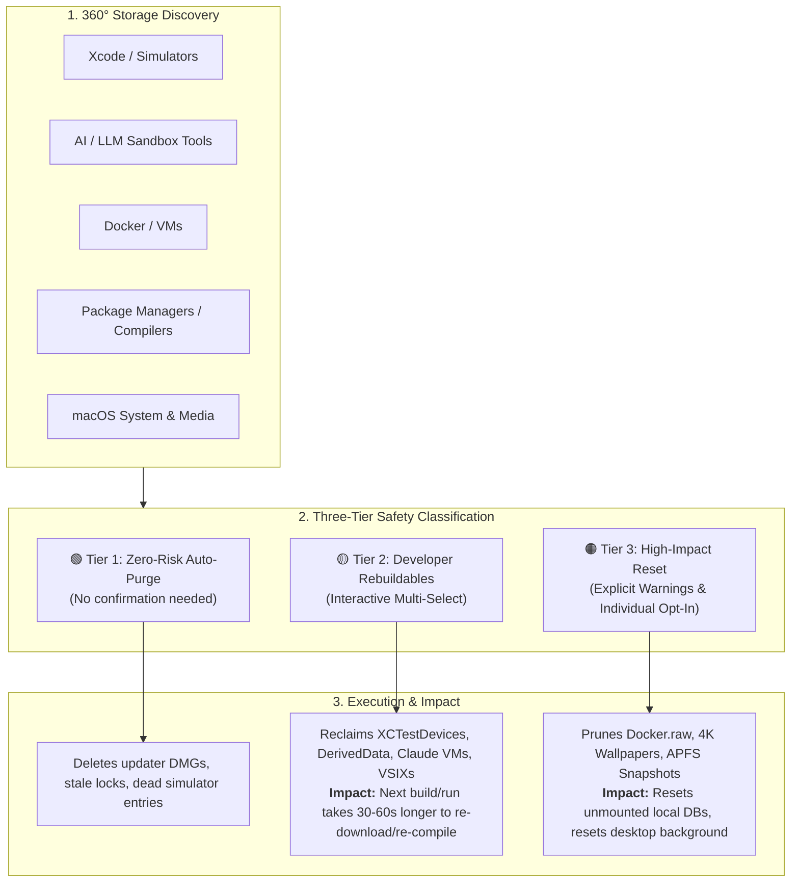
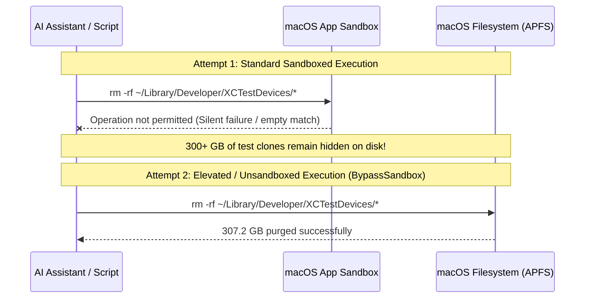
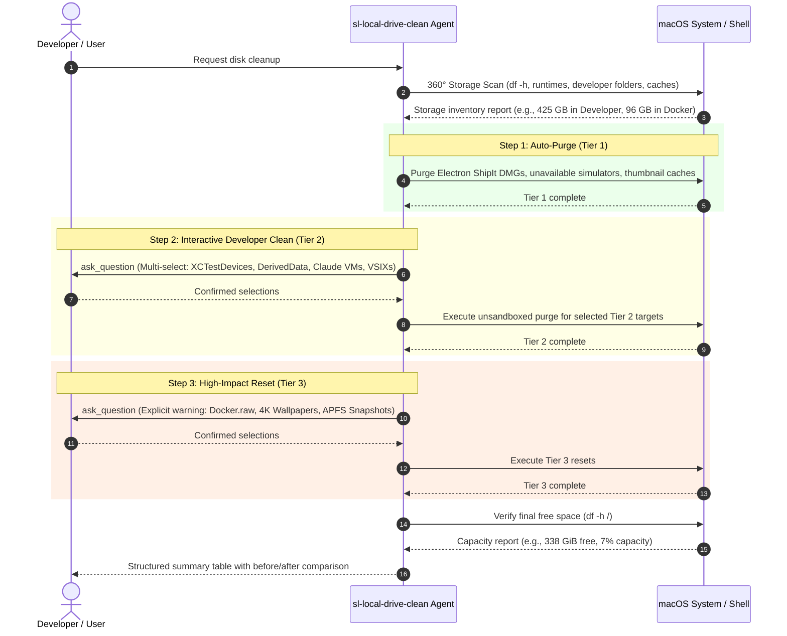
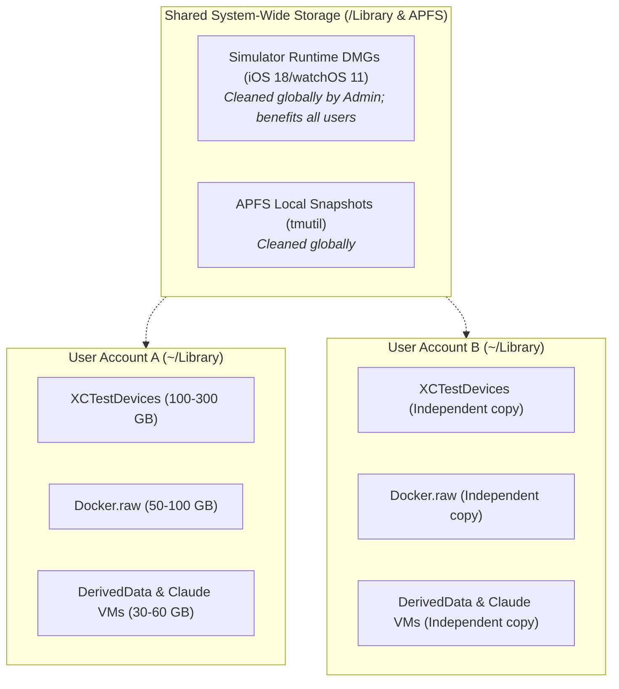

# Local Drive Clean (`sl-local-drive-clean`) Architecture & Reference

> **Comprehensive Guide & Technical Documentation for Developer Disk Space Optimization on macOS**

---

## 1. Executive Summary & Problem Space

Developer workstations running macOS frequently encounter sudden disk exhaustion ("Your disk is almost full" or massive unexplained "System Data" in macOS Storage Settings). 

Standard consumer cleaning utilities (e.g., CCleaner, CleanMyMac) are designed for typical desktop users. They inspect user caches, browser cookies, and trash bins, but **fail to detect or clean 80% to 90% of developer bloat**—such as parallel Xcode test clones, orphaned simulator runtime disk images, Docker virtual raw disks, AI sandbox VM images, and build tool caches.

`sl-local-drive-clean` is an intelligent, multi-tiered cleanup system specifically designed for Apple platform developers, AI engineers, and polyglot software developers. It provides a structured, safe mechanism to reclaim hundreds of gigabytes without unexpected data loss.

---

## 2. The 3-Tier Safety Architecture

To balance aggressive space reclamation with user safety, cleanable assets are categorized into three distinct safety tiers based on their recovery mechanism and user impact:

### Safety Tier Comparison Matrix

| Tier | Confirmation Flow | Target Assets | Recovery / Rebuild Cost | Real Impact on User |
| :--- | :--- | :--- | :--- | :--- |
| **🟢 Tier 1: Zero-Risk Auto-Purge** | **Automatic** (No confirmation required) | • Electron auto-updater DMGs (`*.ShipIt`, `*-updater`) • Unavailable simulator registrations (`xcrun simctl delete unavailable`) • System thumbnail caches (`qlmanage -r cache`) • Stale crash reports | Automatically recreated in background without user intervention. | **Zero Impact**. Pure ephemeral garbage. |
| **🟡 Tier 2: Developer Rebuildables** | **Standard Multi-Select** (Interactive checklist showing estimated size & impact) | • Parallel test clones (`XCTestDevices` ~100–300+ GB) • MCP build cache (`XcodeBuildMCP/workspaces` ~10–60+ GB) • Xcode `DerivedData` & `iOS DeviceSupport` (~20–80+ GB) • Claude Desktop VM bundles (`vm_bundles` ~5–10 GB) • VS Code cached extension installers (`CachedExtensionVSIXs`) • Playwright headless test browsers (`ms-playwright`) • Detached simulator runtimes (iOS 18.x / watchOS 11.x) | Re-created automatically by build tools/compilers on the next run. | **Zero Data Loss**. The *very next* compilation, test suite run, or Claude sandbox execution takes 30–60 seconds longer to compile or download fresh assets. |
| **🟠 Tier 3: High-Impact System Reset** | **Explicit Warning Alert + Per-Item Opt-In** (Detailed warning modal per asset) | • Docker Desktop virtual disk (`Docker.raw` ~20–100+ GB) • macOS 4K dynamic video wallpapers (`com.apple.wallpaper.agent` ~5–20 GB) • APFS local Time Machine snapshots (`tmutil`) • Physical iOS/iPadOS device local backups (`MobileSync/Backup`) | Requires user reconfiguration or re-downloading large media files. | ⚠️ **Potential Configuration / Media Reset**: • **Docker:** Deletes stopped containers, unpinned images, and unmounted database volumes. • **Wallpapers:** Dynamic screensaver resets to default until re-selected. • **APFS Snapshots:** Removes on-disk rollback checkpoints (does not touch external backups). |

---

## 3. Deep-Dive: Root Cause Analysis of Major Storage Hogs

### 1. `~/Library/Developer/XCTestDevices` (300+ GB)
* **Root Cause:** When running parallel UI tests or automated test suites via Xcode, `xcodebuild`, or MCP tools, Xcode clones the base simulator disk image for each parallel test worker (e.g., 16 workers × 19.2 GB = ~307 GB). Xcode often fails to clean up these cloned simulator disks after test suite completion or cancellation.
* **Solution:** `rm -rf ~/Library/Developer/XCTestDevices/*` safely deletes all orphaned clones. Next test execution automatically creates clean clones.

### 2. Docker Virtual Disk Image `Docker.raw` (96.0 GB)
* **Root Cause:** On macOS, Docker Desktop runs inside a lightweight HyperKit/Virtualization.framework Linux VM backed by a raw sparse disk file (`Docker.raw` located in `~/Library/Containers/com.docker.docker/Data/vms/0/data/`). As containers and images are pulled and built, this file expands dynamically up to the configured limit (e.g. 96 GB). However, **APFS does not automatically shrink this sparse file** even after containers or images are deleted inside Docker.
* **Solution:** Run `docker system prune -a --volumes -f` when Docker is active, or safely delete/re-initialize `Docker.raw` to recover up to 96 GB immediately.

### 3. `~/Library/Developer/XcodeBuildMCP` vs. `Xcode/DerivedData` (110+ GB)
* **Root Cause:** Standard Xcode compiles projects into `~/Library/Developer/Xcode/DerivedData`. MCP tools and automated build runners create a separate isolated workspace under `~/Library/Developer/XcodeBuildMCP/workspaces` and `derived-data`. Over multiple project builds and target switches, intermediate object files and index databases accumulate rapidly.
* **Solution:** Deleting both directories resets compile caches without affecting source code.

### 4. Claude Desktop VM Bundles (`vm_bundles` — 5.5 GB)
* **Root Cause:** Claude Desktop's local agent mode downloads and caches complete sandboxed Linux container/VM bundles in `~/Library/Application Support/Claude/vm_bundles` for local code execution.
* **Solution:** `rm -rf ~/Library/Application\ Support/Claude/vm_bundles/*` removes old virtual machines. Claude Desktop re-downloads a fresh bundle on the next code execution session.

### 5. macOS 4K Aerial Wallpapers (`com.apple.wallpaper.agent` — 9.2 GB)
* **Root Cause:** macOS Sonoma and Sequoia feature dynamic 4K HDR aerial video screensavers and wallpapers. Browsing through the wallpaper catalog triggers automatic background downloads of multiple multi-gigabyte `.mov` files.
* **Solution:** `rm -rf ~/Library/Containers/com.apple.wallpaper.agent/Data/Library/Application\ Support/com.apple.wallpaper/Store/*` reclaims the video storage.

### 6. Electron App Auto-Updater DMGs (`ShipIt` — 2–5 GB)
* **Root Cause:** Electron-based desktop applications (VS Code, GitHub Desktop, Typeless, Canva, Postman) download full installer DMGs or ZIP packages into `~/Library/Caches/<app-bundle-id>.ShipIt` or `~/Library/Caches/*-updater` to perform background updates, frequently failing to delete the downloaded installer payload after update installation.
* **Solution:** Purging all `*.ShipIt` and `*-updater` directories in `~/Library/Caches` is 100% safe.

---

## 4. Permission Architecture & The Sandbox Trap

A critical discovery in the evolution of this skill is the **macOS Sandbox & Permission Trap**:

> ⚠️ **Key Architectural Rule:** Deleting developer caches in `~/Library/Developer` (`XCTestDevices`, `XcodeBuildMCP`), `~/Library/Containers/com.docker.docker`, and `com.apple.wallpaper.agent` **requires unsandboxed execution** (`BypassSandbox: true`). Standard sandboxed tools will encounter silent permission denials, leading agents to falsely report that nothing exists to clean.

---

## 5. End-to-End Execution Sequence

---

## 6. Key Decisions & Architecture Log

### Decision 1: Three Distinct Confirmation Tiers instead of a Single "Clean All"
* **Context:** Developers want maximum disk reclamation, but accidental loss of local Docker database volumes or uncommitted scratch experiments causes severe friction.
* **Decision:** Split cleanable targets into Tier 1 (auto), Tier 2 (rebuildable developer artifacts with simple multi-select), and Tier 3 (high-impact resets with individual warnings).
* **Outcome:** Users can safely reclaim 300–400+ GB in seconds with complete peace of mind.

### Decision 2: Mandatory Unsandboxed Elevation for Developer Directories
* **Context:** Sandboxed agent environments restrict access to `~/Library/Developer` and `~/Library/Containers`, causing standard `rm -rf` commands to fail silently.
* **Decision:** Require explicit unsandboxed execution for developer and container directories.
* **Outcome:** Prevented silent cleanup failures and enabled recovery of 307 GB in `XCTestDevices` and 96 GB in `Docker.raw`.

### Decision 3: Preserving Active Simulators While Purging Detached Runtimes
* **Context:** Deleting all simulators breaks developer workflows and requires re-creating test devices.
* **Decision:** Parse `xcrun simctl list devices` to distinguish between active runtimes with configured devices (e.g., iOS 26.5 / watchOS 26.5) versus orphaned older images (e.g., iOS 18.x / watchOS 11.x).
* **Outcome:** Reclaimed ~35 GB of runtime disk images while preserving the user's active iPhone 17 and Apple Watch configurations.

---

## 7. Command Quick-Reference Table

| Target | Command | Safety Tier | Estimated Size |
| :--- | :--- | :--- | :--- |
| **XCTest Parallel Clones** | `rm -rf ~/Library/Developer/XCTestDevices/*` | 🟡 Tier 2 | 100–300+ GB |
| **XcodeBuildMCP Workspaces** | `rm -rf ~/Library/Developer/XcodeBuildMCP/workspaces/*` | 🟡 Tier 2 | 10–60+ GB |
| **Xcode DerivedData** | `rm -rf ~/Library/Developer/Xcode/DerivedData/*` | 🟡 Tier 2 | 20–80+ GB |
| **iOS Device Symbols** | `rm -rf ~/Library/Developer/Xcode/"iOS DeviceSupport"/*` | 🟡 Tier 2 | 5–20 GB |
| **Docker Virtual Disk** | `rm -rf ~/Library/Containers/com.docker.docker/Data/vms/0/data/Docker.raw` | 🟠 Tier 3 | 20–100+ GB |
| **macOS 4K Wallpapers** | `rm -rf ~/Library/Containers/com.apple.wallpaper.agent/Data/Library/Application\ Support/com.apple.wallpaper/Store/*` | 🟠 Tier 3 | 5–20 GB |
| **Claude Desktop VMs** | `rm -rf ~/Library/Application\ Support/Claude/vm_bundles/*` | 🟡 Tier 2 | 5–10 GB |
| **VSCode Updater DMGs** | `rm -rf ~/Library/Caches/com.microsoft.VSCode.ShipIt/*` | 🟢 Tier 1 | 1–3 GB |
| **VSCode Cached VSIXs** | `rm -rf ~/Library/Application\ Support/Code/CachedExtensionVSIXs/*` | 🟡 Tier 2 | 1–2 GB |
| **SwiftPM Cache** | `rm -rf ~/Library/Caches/org.swift.swiftpm` | 🟢 Tier 1 | 1–3 GB |
| **NPM Cache** | `npm cache clean --force` | 🟢 Tier 1 | 1–5 GB |
| **Homebrew Cache** | `brew cleanup --prune=all || true` | 🟢 Tier 1 | 0.5–2 GB |
| **Playwright Browsers** | `rm -rf ~/Library/Caches/ms-playwright/*` | 🟡 Tier 2 | 1–3 GB |
| **Orphaned Simulators** | `xcrun simctl delete unavailable` | 🟢 Tier 1 | 1–5 GB |

---

## 8. Multi-User Storage Architecture & Privacy Isolation

On multi-user macOS workstations, disk storage is partitioned into **Per-User Storage** and **System-Wide Storage**. Understanding this separation is essential for understanding multi-account disk recovery and data privacy.

### 1. Why Running on Another Account Reclaims More Space
Over **80% to 90% of developer disk bloat is instantiated per-user** inside each user's `$HOME` directory (`~/Library/Developer`, `~/Library/Containers`, `~/.npm`, `~/.cache`):
- **User A's Environment:** Has its own Xcode test clones (`XCTestDevices`), Docker virtual disk (`Docker.raw`), build caches, and package caches.
- **User B's Environment:** Has completely independent copies of test clones, Docker disks, and build caches.

If User A runs `sl-local-drive-clean`, only User A's home directory is cleaned. If User B is also a developer or runs Docker/AI tools, **switching to User B's account and running the skill will reclaim additional tens or hundreds of gigabytes** from User B's independent caches.

### 2. Privacy & Zero Cross-Account Data Exposure
macOS enforces strict POSIX user isolation (standard home directory permissions are `0700` / `drwx------`):
- **No Cross-User Access:** The cleanup commands strictly reference `$HOME` (`~`). When executed under User B, the script cannot read, inspect, modify, or delete any files, repositories, credentials, or caches belonging to User A.
- **Zero Information Leakage:** Neither user's private code, git history, or workspace settings are ever exposed to the other account.

### 3. System-Wide vs. Per-User Summary

### 4. The Multi-User "Permission Illusion" (Why Unprivileged Scans Underestimate Storage)
When running disk usage utilities (`du -sh /Users/*`) from a standard non-root shell:
- macOS POSIX file permissions (`drwx------` / `0700` on `~/Library`) prevent User A from reading User B's `Library` or private app containers.
- The standard `du` command **silently skips all permission-denied directories** without adding their size to the total.
- **The Result:** User B may appear deceptively small (e.g., reporting only a few megabytes or gigabytes of public files), while secretly hoarding **50–150+ GB of Xcode test clones, DerivedData, and Docker images** inside their protected `~/Library/`.
- **Accurate Sizing:** To accurately measure other users' storage, elevated root access (`sudo du -sh /Users/*`) or logging directly into that user account is required.

